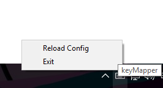

# keyMapper
A python script to map keys to scripts other keys or typing

## Installation
Make sure you have python 3 installed first, you can find it [here](https://www.python.org/downloads/).

Next you just have to download or clone the repo with:
```
git clone https://github.com/cosmeoes/keymapper.git
```
then install the dependencies running:
```
pip install -r requirements.txt
```
if you don't want to use pip you can find the repositories for the dependencies in the [dependencies section](#dependencies) and install them as you want.

# Usage 
To use this script just run the keyMapper.pyw file, if you have python installed double clicking on it should run it, but you can also run it from the command prompt using:
```
python keyMapper.pyw
```
When you run the file a small keyboard icon should appear on your tray bar like this one:


If you right clik on it this menu should appear: 



Here you have two options, exit and Reload Config, this are pretty straightforward:
- **Reload config:** Reloads the configuration file, you should clik this option every time you change the configuaration file when the script's already running, so you don't have to stop it and run it again every time you change the configuaration file.
- **Exit:** This just stops the script, so your keys should now have their default beheavor.

And that's it, now you can start tweaking the configuration file.

## Configuration
The configurations can be found and edited in the keyMapper.conf file.

This file is separated in three sections mapping, hotkey and scripts.

#### Mapping
Here you put keys you want to bind to other keys, for example, if you want to bind the "a" key to write a "b"
when you press it you would do:
```
[Mapping]
a = b
```
NOTE: this configurations only accept a key binding to another key, you can not bind a key to two keys for example:
```
[Mapping]
a = bb # THIS IS WRONG and will produce an error,
aa = b # THIS IS also WRONG and will produce an error.
```

#### Hotkey
Here you can set up multiple key combinations and more complex key presses, for example, if you'd want to write "python is fun"
when you press "ctrl + a" and then "p" you would write:
```
[Hotkey]
ctrl + a, p = python is fun
```
NOTE: this are the modifiers you can use:
'alt', 'alt gr', 'ctrl', 'left alt', 'left ctrl', 'left shift', 'left windows', 'right alt', 'right ctrl', 'right shift', 'right windows', 'shift', 'windows'

#### Scripts
Here you can set up scripts or programs to execute when you press a combination of keys, this follows the same format as the hotkey section.
First you write the keys you what to bind to the script or program and then you write the path to the script or program.
You can also use shell commands instead of the path of your script.
for example if you want to start cmd prompt when you press "windos+enter" you would do it like this:
```
[Scripts]
windows+enter = start
```
you can also pass arguments your scripts with "," after the script's or program's path
for example if you want to launch a python script located at "C:\script.py" and wanted to pass the arguments "argument1" and "argument2" when
you press "ctrl+l, space" you would write:
```
[Scripts]
ctrl+l, space = C:\script.py, argument1, argument2
```

## Dependencies

 - [keyboard](https://github.com/boppreh/keyboard)

 - [Pillow](https://github.com/python-pillow/Pillow)

 - [pystray](https://github.com/moses-palmer/pystray)

## Other Credits
Icon made by [Dave Gandy](https://www.flaticon.com/authors/dave-gandy) from www.flaticon.com
